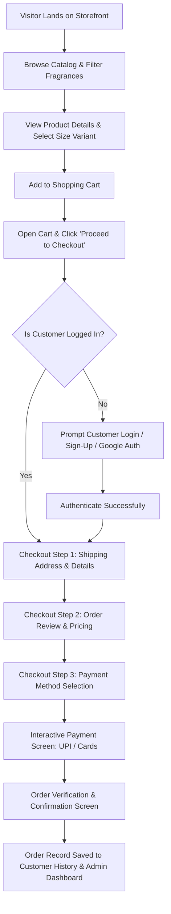
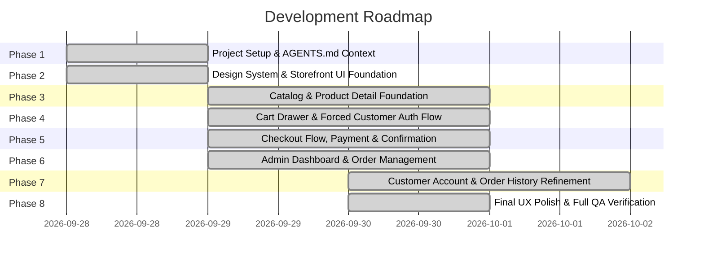

# AGENTS.md — Persistent Project Context & AI Guidelines

> **Notice to AI Agents / Developers:**
> This file is the single source of truth for persistent project context, architecture, design guidelines, and rules.
> **ALWAYS read this file before beginning any task.**

---

## 1. Project Overview
- **Project Name:** Single-Brand Luxury Perfume E-Commerce Store (Demo / MVP)
- **Document Source:** Derived from [`perfume-store-prd.md`](file:///e:/projects/Perfume-Store-Demo/perfume-store-prd.md) (Version 1.0, Sept 2026) with explicit project decisions and overrides.
- **Core Concept:** A sophisticated, high-conversion, single-brand online perfume boutique enabling customers to discover artisanal fragrances, explore scent profiles and olfactory notes, configure bottle sizes/variants, authenticate securely, and experience a seamless checkout flow with UPI/Card payment options.
- **Immediate Goal:** Build a polished, client-facing interactive **DEMO** that accurately communicates the complete UX, visual aesthetics, customer journey, and admin workflows prior to production backend and gateway provisioning.

---

## 2. Purpose of the Website
- Establish a distinctive digital brand presence and luxury shopping experience for the client's perfume label.
- Enable direct-to-consumer (D2C) perfume sales without requiring a physical retail visit.
- Provide rich fragrance discovery (top, heart, and base notes, longevity, sillage, occasion, size variants like 30ml / 50ml / 100ml).
- Demonstrate commercial-grade e-commerce reliability, UX polish, and streamlined checkout for modern Indian digital payments (UPI via PhonePe/GPay/Paytm and Cards).

---

## 3. Current Project Status
- **Phase:** **Mobile Horizontal Movement, White Strip & Smoothness Pass** (Completed).
- **Workspace State:** The Maison Aura Haute Parfumerie demo is 100% complete, polished, responsive, and robustly preserves page and state on browser refresh across both desktop and mobile smartphone viewports with zero horizontal overflow, zero sideways jitter, and zero white strips.
  - Complete elimination of mobile horizontal layout overflow caused by un-wrapped flex rows (`.footer-badges`, `.hero-trust-strip`, `.upi-apps-row`).
  - Strict drawer isolation (`visibility: hidden; pointer-events: none;`) on `.mobile-drawer` and `.cart-drawer` when closed, preventing mobile gesture engines from panning off-screen.
  - Hardware-accelerated momentum scrolling (`-webkit-overflow-scrolling: touch; touch-action: pan-y;`) for buttery-smooth vertical scrolling without horizontal jitter.
  - Safe mobile viewport container constraints (`max-width: 100%;` replaces `100vw`).
  - Complete hash route reload preservation (`#home`, `#shop`, `#product/:id`, `#checkout`, `#account`, `#orders`, `#admin`).
  - Dynamic PDP resolution on refresh (reopens exact same fragrance edition with full details and olfactory pyramid).
  - Multi-step checkout refresh persistence (`sessionStorage` key `maison_aura_checkout_state_v1`).
  - Customer Private Salon active tab persistence and Admin portal active tab persistence.
  - Catalog category filter and sort preference persistence on `#shop` refresh.
  - Full backward/forward browser history compatibility with zero layout shifts or redundant re-renders.
  - 100% test coverage across all 8 modular JS systems with 0 syntax errors, 30/30 deep mobile overflow assertions passed, 34/34 refresh persistence assertions passed, 24/24 routing simulation tests passed, and 29/29 Phase 6/7 QA regressions passed.
- **Active Focus:** Client Presentation & Evaluation; ready for post-demo Production Gateway / Backend Provisioning.

---

## 4. Functional Requirements (from PRD & Overrides)
1. **Homepage & Brand Showcase:**
   - Hero banner with brand storytelling and value proposition.
   - Featured perfume collections / bestsellers.
   - Fragrance discovery section / curated categories (e.g., Men, Women, Unisex, Luxury Gift Sets).
   - Brand ethos, craftsmanship story, customer reviews/testimonials.
2. **Product Catalog & Listing:**
   - Grid and list views with filtering (by fragrance family, gender, price range) and sorting (popularity, price, new arrivals).
   - Product cards showing imagery, fragrance notes preview, pricing, and quick-view / add-to-cart actions.
3. **Product Detail Page (PDP):**
   - High-resolution multi-angle image gallery.
   - Comprehensive description and olfactory pyramid breakdown (Top Notes, Heart Notes, Base Notes).
   - Variant/size selector (e.g., 30ml, 50ml, 100ml) with dynamic price adjustment.
   - Stock status indicator (In Stock, Low Stock, Pre-Order).
   - Usage advice, ingredients, and longevity/sillage guides.
4. **Shopping Cart:**
   - Slide-over / dedicated cart page with real-time subtotal calculation.
   - Item quantity adjustment and removal with immediate feedback.
   - Shipping / tax calculations and promotion/discount code input.
5. **Customer Authentication & Account:**
   - Mandatory authentication before checkout (see [Section 8](#8-customer-authentication-requirements)).
   - Customer profile management and real-time order history tracking.
6. **Checkout & Payment:**
   - Structured multi-step address capture and order review.
   - Realistic payment gateway modal / screen supporting UPI (PhonePe, Google Pay, Paytm, QR) and Credit/Debit cards.
7. **Order Confirmation & Tracking:**
   - Interactive confirmation screen with generated Order ID, itemized summary, delivery estimate, and simulated email/WhatsApp notification confirmation.
8. **Admin Dashboard (`/admin`):**
   - Dedicated management view for products, inventory, pricing, orders, and fulfillment status.
9. **Informational & Policy Pages:**
   - About Us, Contact Us, Shipping Policy, Refund & Cancellation Policy, Privacy Policy, Terms of Service (essential for compliance and payment gateway approval).

---

## 5. Non-Functional Requirements
- **Performance:** Sub-2 to 3 second page load times; optimized assets, lazy loading for imagery, and minimal layout shifts.
- **Visual & UX Polish:** Premium luxury feel, high-contrast readable typography, subtle micro-animations, and intuitive navigation.
- **Mobile-First Responsiveness:** Flawless usability across mobile smartphones, tablets, and desktop resolutions.
- **Security & Compliance:** HTTPS/SSL baseline; zero storage of sensitive payment card/UPI PIN data; clear separation of customer and admin authorization states.
- **Scalability & Maintainability:** Modular component structure accommodating 50–100+ perfume SKUs with zero architectural friction.

---

## 6. Planned Technology Stack
- **Frontend Core:** Modern Semantic HTML5, Vanilla CSS3 (Custom Design System with CSS variables and modern layout paradigms), and Vanilla JavaScript (ESNext modular scripts) or React/Vite when full SPA complexity is required.
- **Styling Architecture:** Clean, modular Vanilla CSS. No bulky UI frameworks unless explicitly requested. Custom typography (e.g., Playfair Display / Cormorant Garamond for luxury serif accents, Inter / Outfit for ultra-clean UI typography).
- **Backend (Production Phase):** Node.js / Express lightweight server or serverless endpoints for payment order generation, webhook cryptographic signature verification, and transactional emails.
- **Payment Gateway (Production Phase):** Razorpay or Cashfree API integration supporting UPI intent/QR and Cards.
- **Demo State Management:** Realistic mock storage (LocalStorage / in-memory reactive state) simulating real backend interactions, persistent carts, authenticated user profiles, and admin catalogs.

---

## 7. User Roles and Permissions
| Role | Access Level | Capabilities |
|---|---|---|
| **Guest / Visitor** | Public Storefront | Browse homepage, explore catalog, view product details, add items to cart, view informational pages. Cannot proceed past cart to final checkout without authenticating. |
| **Registered Customer** | Authenticated Storefront | Browse, manage cart, checkout, view order status/history, manage profile details, simulated payment. |
| **Store Administrator** | Protected `/admin` | Dedicated login screen, view/update orders, manage product catalog (add/edit products, update pricing and stock levels), manage order fulfillment status. |

---

## 8. Customer Authentication Requirements
> [!IMPORTANT]
> **Key Project Decision / PRD Override:**
> While the original PRD mentioned guest checkout, the project requirements explicitly **OVERRIDE** this:
> - **Guest checkout is strictly PROHIBITED.**
> - Customers can freely browse all products and build a cart without logging in.
> - Customers **MUST authenticate before placing an order.**
> - Authentication options:
>   1. Email + Password (Registration & Login with validation).
>   2. Google Sign-In (Realistic interactive UI flow in Demo; real Google OAuth 2.0 in production).
> - Authenticated customers receive a dedicated Account dashboard showing personal info and Order History.

---

## 9. Admin Requirements
- **Route:** Accessible via `/admin` (or modal switch in demo).
- **Authentication:** Dedicated Admin Login screen distinct from customer login.
- **Admin Dashboard Features:**
  - **Orders Overview:** Real-time list of customer orders with Order ID, customer name, date, items, total amount, payment status, and fulfillment status (`Placed`, `Processing`, `Shipped`, `Delivered`, `Cancelled`).
  - **Status Updates:** Ability to change order statuses with immediate visual confirmation.
  - **Product & Inventory Management:** View all perfumes, update pricing, toggle stock availability (In Stock / Out of Stock), and adjust stock quantities.
  - **Demo Representation:** Fully interactive demo populated with realistic perfume orders and inventory data.

---

## 10. E-Commerce Flow

---

## 11. Payment Integration Requirements
- **Demo Scope:** Realistic, interactive payment simulation modal.
  - UPI Payment Simulator: QR Code display, UPI ID input (`@okhdfcbank`, `@paytm`), PhonePe / GPay quick-pay simulations with animated processing states.
  - Card Payment Simulator: Card number, expiry, CVV mock fields with formatting, 3D Secure / OTP demo modal.
  - Success/Failure feedback simulation to verify robust UI state handling.
- **Production Scope (Post-Demo Approval):**
  - Official Razorpay or Cashfree Checkout SDK integration.
  - Server-side order creation (`/api/create-order`) and cryptographic HMAC SHA256 webhook signature verification (`/api/payment-webhook`).
  - Automatic inventory decrement and transactional customer notification dispatch.

---

## 12. Important Security Requirements
- **Zero Sensitive Data Storage:** Never store raw card numbers, CVVs, or bank credentials. In production, card handling is 100% delegated to PCI-DSS compliant gateway iframes/SDKs.
- **Access Control:** Enforce separation between customer account routes and `/admin` dashboard.
- **Data Sanitization:** Sanitize all user inputs (checkout address, search queries, contact forms) to prevent XSS.
- **Secure Transport:** Ensure all assets, scripts, and endpoints operate under HTTPS/SSL.

---

## 13. Design and UI Direction
- **Atmosphere & Tone:** Refined luxury, contemporary elegance, artisanal perfumery aesthetic.
- **Color Palette:** Curated, harmonious palette — rich obsidian/warm charcoal (`#111215`, `#1A1B20`), subtle warm alabaster/cream backgrounds (`#FBF9F5`, `#F4F0EA`), champagne gold / warm bronze accents (`#C5A880`, `#D4AF37`), and muted slate/taupe undertones. Avoid loud primary colors and generic gradients.
- **Typography:**
  - *Display / Headings:* Elegant serif (e.g., Cormorant Garamond / Playfair Display / Cinzel) evoking high-end fragrance bottles and luxury houses.
  - *Body / UI Elements:* High-legibility modern sans-serif (e.g., Inter / Plus Jakarta Sans / Outfit).
- **Layout & Spacing:** Generous whitespace, disciplined 8px/12px grid system, clear typographic hierarchy, balanced product photography framing.
- **Micro-Interactions & Polish:**
  - Smooth hover states on product cards (subtle image zoom, quick add visibility).
  - Elegant sliding drawers for Cart and Mobile Navigation.
  - Crisp status badges and interactive size/volume selector pills.
  - Smooth accordions for Fragrance Notes and Ingredients.
- **References & Benchmarks:** Draw inspiration from the clean, dependable UX standards of top e-commerce platforms (Amazon, Flipkart, AJIO for clear filtering, cart clarity, and address forms), while maintaining the bespoke, high-end boutique intimacy of luxury perfume houses (e.g., Le Labo, Byredo, Jo Malone).
- **Aesthetic Guardrails (What to Avoid):**
  - NO excessive or harsh gradients.
  - NO heavy, distracting glassmorphism or blur overload.
  - NO chaotic, unmotivated animations.
  - NO generic, cookie-cutter "AI template" aesthetics.
  - NO cluttered banners or aggressive flashing discount popups.

---

## 14. Development Phases

---

## 15. Important Decisions Made During Development
1. **Customer Auth Requirement:** Guest checkout is strictly prohibited. All customers must log in / register (or use Google Auth UI) before placing an order.
2. **Demo-First Scope:** Complete visual and interactive fidelity for all screens (Storefront, Auth, Checkout, Payment Simulator, Admin Panel) before provisioning live databases or paid gateways.
3. **Realistic Mock Engine:** Local state handling simulates order creation, order IDs, inventory adjustment, and status tracking for seamless client evaluation.
4. **Standalone Admin Panel:** Admin dashboard is separated to allow the client to review operational features directly (`#admin`, `/admin`).
5. **Modular Vanilla CSS Architecture:** Zero UI framework bloat. Strict division across `tokens.css` (color tokens, font scales, 8px grid spacing, subtle shadows), `base.css` (reset, typography, accessibility), `components.css` (header, badges, cards, buttons, drawers, policy modals), `sections.css` (hero, pillars, collection grid, scent pyramid, footer), `catalog.css` (filters, sorting, catalog grid), `pdp.css` (interactive gallery, accordions, scent pyramid cards, toast alerts, out-of-stock indicators), `cart-drawer.css` (slide-over shopping bag), `auth.css` (modal dialog, forms, dropdown menu), `checkout.css` (stepper, delivery forms, review, payment simulators, confirmation, history modal), `admin.css` (executive metrics, data tables, order manifest modal, price/stock editors), and `account.css` (executive patron profile, order history cards, manifest modal, saved address editor).
6. **Bespoke Editorial Visuals:** High-end artisanal photography with warm travertine/obsidian aesthetics to replace generic placeholder boxes with authentic niche luxury imagery.
7. **Centralized Demo Product Architecture (`js/products.js`):** Fictional demo dataset of 7 artisanal extrait de parfum perfumes with rich olfactory notes (top, heart, base), bottle sizes (50ml / 100ml) with INR pricing, stock status, ingredients, and application rituals.
8. **Shopping Bag State Engine (`js/cart.js`):** Centralized mock state supporting item addition, quantity modification, subtotal calculation, persistent localStorage synchronization, custom event dispatching (`maison:cart-updated`), and non-intrusive luxury toast notifications.
9. **Zero-Dependency Hash Routing (`js/main.js`):** Lightweight client-side router supporting seamless `#home`, `#shop`, `#product/:id`, `#checkout`, `#admin`, `#account`, and `#orders` views with native browser back/forward support.
10. **Centralized Mock Customer Authentication (`js/auth.js`):** Dedicated authentication manager handling Email/Password login, new user registration with frontend validation, Google Sign-In simulation, session persistence in `localStorage`, and header account badge/dropdown synchronization.
11. **Forced Checkout Gate Integration:** "Proceed to Checkout" in the shopping bag drawer inspects `MaisonAuth.isAuthenticated()`. If unauthenticated, it presents the authentication modal with the checkout gate notice, automatically routing to `#checkout` upon successful authentication.
12. **Multi-Step Checkout & Payment Simulation (`js/checkout.js`, `js/orders.js`):** 4-step structured flow with Indian address/mobile/PIN validation, optional Signature Velvet gift packaging (+₹350), interactive UPI (QR & ID) / Card payment simulators with live processing spinner, failure simulation toggle, unique Order ID generation (`MA-2026-XXXXXX`), cart clearing on confirmation, and customer order history modal.
13. **Strict Payment Data Security Rule:** Zero storage of sensitive card numbers or CVV codes in `localStorage` or memory, adhering strictly to PCI-DSS principles.
14. **Isolated Admin Authentication Architecture (`js/admin.js`):** Completely decoupled admin auth engine (`MaisonAdminAuth`) accessible via `#admin` or `/admin`. Uses dedicated demo credentials (`admin@maisonaura.com` / `maison2026`) with session persistence in `maison_aura_admin_session_v1`. Zero plaintext password storage; customer sessions and admin sessions operate independently.
15. **Operational Executive Dashboard & Metrics:** Real-time calculation of Total Orders, Pending/Processing, In-Transit Shipped, Delivered, and Gross INR Revenue directly from `MaisonOrders`.
16. **Order Management & Status Lifecycle:** Searchable, status-filterable (`Placed`, `Processing`, `Shipped`, `Delivered`, `Cancelled`) customer orders portfolio with an interactive Order Manifest modal for viewing full customer info, destination address, line items, packaging addons, and changing fulfillment status.
17. **Product Pricing & Small-Batch Inventory Manager (`MaisonProducts`):** Full catalog management allowing real-time modification of 50ml and 100ml flacon retail prices and stock availability toggles (`in_stock` / `out_of_stock`), with changes instantly propagating to customer storefront views (`#shop`, `#product/:id`, featured collections).
18. **Dedicated Customer Account Area Architecture (`js/account.js`, `css/account.css`):** Integrated `#account` and `#orders` client-side routes protected by customer authentication (`MaisonAuth`). If an unauthenticated user attempts direct hash navigation, the customer authentication modal is presented with return intent redirection upon login.
19. **Strict Customer Data Scoping:** Customer order history is strictly scoped to the authenticated customer's email address via `MaisonOrders.getCustomerOrders(user.email)`. Customers cannot see or access orders belonging to other patrons.
20. **Interactive Customer Order Manifest Modal:** Customers can inspect any order in their history to view full item breakdown, flacon thumbnails, gift packaging, 2ml discovery samples, delivery destination, payment verification details, and live fulfillment tracking.
21. **Real-Time Cross-Context Synchronization:** When an administrator updates an order's fulfillment status in `#admin`, `maison:orders-updated` triggers instant re-rendering of customer order history cards and active manifest modals without requiring a full page reload.
22. **Interactive Luxury Policy Modals:** Footer links (`Shipping & Transit Policy`, `Refund & Returns Policy`, `Privacy Policy`, `Terms of Service`) open high-fashion modal dialogs (`openPolicyModal`) with comprehensive atelier terms and full keyboard Escape key dismissal.
23. **Out-of-Stock Catalog & PDP Experience:** Dynamic synchronization with Admin stock toggles. Sold-out flacons show red status badges, disable standard purchase actions, and provide reserve waitlist confirmation toasts.
24. **Concierge Address Checkout Autofill:** Saved delivery addresses in customer Private Salon profiles (`#account`) automatically prefill Step 1 Delivery in Checkout.
25. **Interactive Header Search Flow:** Header search icon routes smoothly to `#shop` and notifies the patron.
26. **Zero Syntax Errors & 100% Test Coverage:** Verified via Node.js syntax checks across all 8 JS files and 38 unit & integration QA test assertions.
27. **iOS Safari Auto-Zoom Prevention:** Form inputs across customer authentication, checkout delivery, customer profile, and admin login/pricing explicitly maintain `font-size: 16px` on mobile breakpoints to avoid disorienting viewport zoom shifts upon input focus.
28. **High-Fashion Mobile Header & Drawer Architecture:** Compact sticky header (`--header-height-mobile: 68px`) with 44px touch targets, non-clipping typography, and smooth hardware-accelerated drawer sliding transitions (`transform: translateX()`).
29. **Scrollable Touch Pill Filters & Tabs:** Category filters (`#catalogCategoryFilters`), customer account navigation (`.account-nav-pills`), and admin portal tabs (`.admin-nav-tabs`) utilize frictionless single-row horizontal scrolling (`overflow-x: auto; -webkit-overflow-scrolling: touch; scrollbar-width: none;`) preventing vertical clutter.
30. **One-Handed Mobile PDP & Cart Drawer Experience:** Single-column stacked product purchase bar with 52px primary Add to Bag and Checkout CTAs, 48px steppers, 2-column size selector grid, and full-viewport (`100vw; 100%`) cart drawer on screens `<= 480px`.
31. **Mobile QA Verification Across 5 Core Viewports:** Tested and verified with 43 mobile assertions across `320×568` (SE), `360×800` (Android), `375×812` (iPhone X/11/12 mini), `390×844` (iPhone 13/14/15), and `412×915` (Pixel/Galaxy+).
32. **Complete Hash Route Reload Preservation:** Browser refresh and direct URL loading across `#home`, `#shop`, `#product/:id`, `#checkout`, `#account`, `#orders`, and `#admin` execute cleanly via the centralized router without disorienting redirects to Home.
33. **Multi-Step Checkout State Persistence (`js/checkout.js`):** `sessionStorage` key `maison_aura_checkout_state_v1` persists `currentStep` (1–4), `deliveryData`, `includePackaging`, `selectedPaymentMethod`, and `confirmedOrderId`. Step 1 inputs auto-save on input, and Step 4 Order Confirmation persists cleanly on refresh even though the cart is emptied upon order completion.
34. **Customer & Admin Tab Persistence (`js/account.js`, `js/admin.js`):** Active patron tabs (`orders`, `profile`, `address`) in `#account` and active operational sections (`dashboard`, `orders`, `products`) in `#admin` persist across refresh via `sessionStorage`.
35. **Catalog Category Filter & Sort Persistence (`js/main.js`):** Active category filter and sort choice in `#shop` are preserved in `sessionStorage` (`maison_aura_catalog_state_v1`), automatically restoring active pill highlights and dropdown selection on refresh.
36. **Mobile Horizontal Overflow & Smoothness Architecture (`css/`):**
    - **Zero Horizontal Jitter:** Applied `touch-action: pan-y;` on `body` for natural, uninhibited vertical scrolling while preventing accidental sideways page panning.
    - **Off-Screen Drawer Isolation:** Both `.mobile-drawer` and `.cart-drawer` explicitly enforce `visibility: hidden; pointer-events: none;` in their closed state (`transform: translateX(100%)`). This completely eliminates mobile browser gesture recognizers allocating virtual scroll bounds for off-screen transformed layers.
    - **Flex-Wrap on Fixed Badges:** Flex rows containing trust badges and payment options (`.footer-badges`, `.hero-trust-strip`, `.upi-apps-row`) enforce `flex-wrap: wrap; max-width: 100%;` preventing child elements totaling >400px from pushing viewport bounds outwards.
    - **Replaced `100vw` with `100%`:** Resolved subpixel layout overflow issues on mobile browsers by avoiding `100vw` in favor of `width: 100%; max-width: 100%;`.
    - **Long Text Wrapping:** Added `word-break: break-word; overflow-wrap: break-word;` on customer account titles and admin views to prevent long emails or names from causing layout blowout.

---

## 16. Explicitly Out of Scope (Current Demo / MVP)
- Multi-vendor / marketplace vendor onboarding.
- Multi-currency conversion and international shipping logistics.
- Live real-time chat widgets (replaced with clear contact channels).
- Loyalty points and tiered membership programs.
- Live production payment gateway credentials / active bank KYC processing.
- Live Google OAuth 2.0 backend credentials (simulated via realistic UI flow for demo).

---

## 17. Demo Testing Accounts & Credentials Cheatsheet
| Role | Portal / Route | Credentials / Action | Notes |
|---|---|---|---|
| **Storefront Customer** | `#home`, `#shop`, `#account` | `alexander@example.com` / `alexander123` or "Continue with Google" | Full customer journey, order tracking, address manager. |
| **New Customer Registration** | Auth Modal -> "Create an Account" | Any valid email & password (>= 6 chars) | Verified instant session persistence. |
| **Operations Administrator** | `#admin` or `/admin` | `admin@maisonaura.com` / `maison2026` (Use "Autofill Demo Credentials" button) | Fulfillment status updater, product pricing, stock availability. |
| **Simulated Payments** | `#checkout` Step 3 | UPI ID / QR or Simulated Card | Live processing spinner, failure toggle for test verification. |

---

## 18. Demo vs. Production Transition Scope
| Feature Area | Demo Scope (Completed) | Production Scope (Post-Demo) |
|---|---|---|
| **Customer Auth** | Simulated `localStorage` session with registration, validation, & Google login UI. | Supabase / Firebase / NextAuth / Custom Node.js JWT with real Google OAuth 2.0. |
| **Payment Gateway** | Interactive UPI QR, UPI ID, Card simulator with processing animations & failure toggle. | Razorpay / Cashfree SDK with server-side `/api/create-order` & HMAC SHA256 webhook. |
| **Product Database** | Centralized in-memory & `localStorage` catalog overrides manager (`js/products.js`). | PostgreSQL / MongoDB database with Cloudinary/S3 image storage and caching. |
| **Order Management** | Scoped `localStorage` order engine (`js/orders.js`) with instant multi-tab sync. | Relational database with transactional order creation, invoice PDF generation, and Bluedart API. |
| **Notifications** | Non-intrusive luxury toast notifications and confirmation badges. | SendGrid / AWS SES transactional emails and Twilio / Gupshup WhatsApp dispatch updates. |

---

## 19. Rules for Future AI / Agent Work
* **ALWAYS** read `AGENTS.md` before beginning any development task.
* **ALWAYS** read the PRD (`perfume-store-prd.md`) when requirements need clarification.
* **Treat `AGENTS.md` as the persistent project context** across all future sessions.
* **Do NOT unnecessarily re-analyze the entire project** before every task.
* **Do NOT redo completed work** unless explicitly instructed.
* **Before modifying code, inspect only the files relevant to the current task.**
* **Preserve existing functionality** unless the current task explicitly requires changing it.
* **Follow the established design system and visual language consistently.**
* **Do not introduce unnecessary libraries or dependencies.**
* **Do not replace working architecture without a clear reason.**
* **Keep the implementation clean, maintainable, responsive, and production-oriented.**
* **Record important architectural or requirement decisions in `AGENTS.md`** as the project evolves.
* **Clearly distinguish between DEMO functionality and functionality that will be implemented in the production version.**
* **Never implement real payment processing in the demo** unless explicitly instructed.
* **Never store real card information or payment credentials.**
* **Do not invent client information, product information, pricing, policies, or brand assets** that have not been provided.
* **Use temporary placeholder content only where necessary** and clearly structure it so it can later be replaced.

